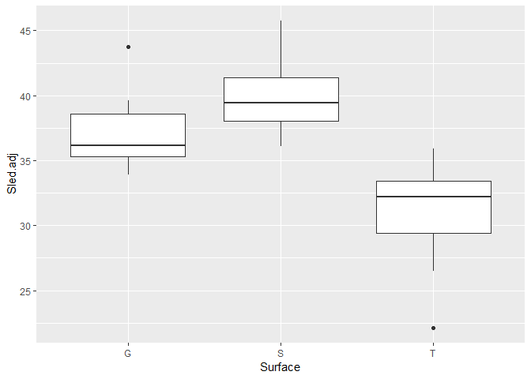

ACFT
================
Kevin Cummiskey
September 23, 2019

Read in the data and perform data analysis.

``` r
acft = read_csv("https://raw.githubusercontent.com/nick3703/MA376/master/ACFT.csv")
```

    ## Parsed with column specification:
    ## cols(
    ##   Participant = col_integer(),
    ##   Surface = col_character(),
    ##   Sled = col_double(),
    ##   Event = col_integer()
    ## )

``` r
acft %>% ggplot(aes(x = Surface, y = Sled)) + geom_boxplot()
```


Analysis 1 - Fit a model for surface effect
===========================================

*y*<sub>*i**j*</sub> = *μ* + *α*<sub>*j*</sub> + *ϵ*<sub>*i**j*</sub>

where *α*<sub>*j*</sub> is the effect of surface *j*.

This is a bad thing to do as our model assumes iid error, which is not the case because we have multiple measurements on each subject.

``` r
acft$Surface = factor(acft$Surface, levels = c("G","S","T"))
contrasts(acft$Surface) = contr.sum
single.lm = lm(Sled ~ Surface, data = acft)
summary(single.lm)
```

    ## 
    ## Call:
    ## lm(formula = Sled ~ Surface, data = acft)
    ## 
    ## Residuals:
    ##     Min      1Q  Median      3Q     Max 
    ## -11.460  -4.648  -0.538   4.052  17.964 
    ## 
    ## Coefficients:
    ##             Estimate Std. Error t value Pr(>|t|)    
    ## (Intercept)  36.0780     0.7637  47.241  < 2e-16 ***
    ## Surface1      0.8820     1.0800   0.817 0.416826    
    ## Surface2      3.7580     1.0800   3.480 0.000857 ***
    ## ---
    ## Signif. codes:  0 '***' 0.001 '**' 0.01 '*' 0.05 '.' 0.1 ' ' 1
    ## 
    ## Residual standard error: 6.614 on 72 degrees of freedom
    ## Multiple R-squared:  0.2243, Adjusted R-squared:  0.2028 
    ## F-statistic: 10.41 on 2 and 72 DF,  p-value: 0.0001068

``` r
anova(single.lm)
```

    ## Analysis of Variance Table
    ## 
    ## Response: Sled
    ##           Df  Sum Sq Mean Sq F value    Pr(>F)    
    ## Surface    2  910.75  455.38   10.41 0.0001068 ***
    ## Residuals 72 3149.46   43.74                      
    ## ---
    ## Signif. codes:  0 '***' 0.001 '**' 0.01 '*' 0.05 '.' 0.1 ' ' 1

Note the large *p*-value for Surface 1.

Simulation based approach for Analysis 1
========================================

``` r
f.sim = c()
m = 5000

for(i in 1:m){
  acft$Surface.sim = sample(acft$Surface)
  sim.model = lm(Sled ~ Surface.sim, data = acft)
  f.sim[i] = anova(sim.model)$"F value"[1]
}

hist(f.sim)
```


Now, let's look at person effects.

``` r
summary = acft %>% group_by(Participant) %>% summarise(mean = mean(Sled))
```

    ## Warning: The `printer` argument is deprecated as of rlang 0.3.0.
    ## This warning is displayed once per session.

``` r
summary %>% ggplot(aes(x = Participant, y = mean)) + geom_point()
```


Let's fit a model that includes person effects

*y*<sub>*i**j*</sub> = *μ* + *α*<sub>*j*</sub> + *β*<sub>*i*</sub> + *ϵ*<sub>*i**j*</sub>

where *α*<sub>*j*</sub> is the effect of surface *j* and *β*<sub>*i*</sub> is the effect of person *i* (also called the block effect).

``` r
acft$Participant = factor(acft$Participant)
contrasts(acft$Participant) = contr.sum

#IMPORTANT - don't use factor in Partipant below
# Doing so will reset the contrasts you set in contr.sum

adj.mod = lm(Sled ~ Surface + Participant, data = acft)
summary(adj.mod)
```

    ## 
    ## Call:
    ## lm(formula = Sled ~ Surface + Participant, data = acft)
    ## 
    ## Residuals:
    ##    Min     1Q Median     3Q    Max 
    ## -9.293 -1.753  0.240  1.862  6.785 
    ## 
    ## Coefficients:
    ##               Estimate Std. Error t value Pr(>|t|)    
    ## (Intercept)    36.0780     0.3647  98.927  < 2e-16 ***
    ## Surface1        0.8820     0.5158   1.710 0.093702 .  
    ## Surface2        3.7580     0.5158   7.286 2.68e-09 ***
    ## Participant1   -4.7780     1.7866  -2.674 0.010207 *  
    ## Participant2   -8.8113     1.7866  -4.932 1.02e-05 ***
    ## Participant3    0.2220     1.7866   0.124 0.901631    
    ## Participant4   -1.0447     1.7866  -0.585 0.561479    
    ## Participant5    1.5220     1.7866   0.852 0.398509    
    ## Participant6   -6.6447     1.7866  -3.719 0.000523 ***
    ## Participant7   -6.8447     1.7866  -3.831 0.000370 ***
    ## Participant8   -4.5447     1.7866  -2.544 0.014243 *  
    ## Participant9    2.9553     1.7866   1.654 0.104625    
    ## Participant10  -2.3113     1.7866  -1.294 0.201965    
    ## Participant11  -0.2780     1.7866  -0.156 0.877001    
    ## Participant12   4.8553     1.7866   2.718 0.009120 ** 
    ## Participant13   9.5887     1.7866   5.367 2.29e-06 ***
    ## Participant14   8.1887     1.7866   4.583 3.28e-05 ***
    ## Participant15   1.3553     1.7866   0.759 0.451802    
    ## Participant16  -0.5780     1.7866  -0.324 0.747711    
    ## Participant17  -4.5280     1.7866  -2.534 0.014581 *  
    ## Participant18  -8.9113     1.7866  -4.988 8.40e-06 ***
    ## Participant19  -5.8780     1.7866  -3.290 0.001882 ** 
    ## Participant20   6.0553     1.7866   3.389 0.001409 ** 
    ## Participant21  10.4220     1.7866   5.833 4.50e-07 ***
    ## Participant22   4.8887     1.7866   2.736 0.008686 ** 
    ## Participant23  -4.6113     1.7866  -2.581 0.012962 *  
    ## Participant24  12.0553     1.7866   6.748 1.79e-08 ***
    ## ---
    ## Signif. codes:  0 '***' 0.001 '**' 0.01 '*' 0.05 '.' 0.1 ' ' 1
    ## 
    ## Residual standard error: 3.158 on 48 degrees of freedom
    ## Multiple R-squared:  0.8821, Adjusted R-squared:  0.8182 
    ## F-statistic: 13.81 on 26 and 48 DF,  p-value: 1.552e-14

``` r
anova(adj.mod)
```

    ## Analysis of Variance Table
    ## 
    ## Response: Sled
    ##             Df  Sum Sq Mean Sq F value    Pr(>F)    
    ## Surface      2  910.75  455.38  45.651 7.849e-12 ***
    ## Participant 24 2670.66  111.28  11.155 1.714e-12 ***
    ## Residuals   48  478.81    9.98                      
    ## ---
    ## Signif. codes:  0 '***' 0.001 '**' 0.01 '*' 0.05 '.' 0.1 ' ' 1

Note the smaller *p*-values after adjusting for block effects.

Analysis 2 - revising the simulation to adjust for blocking
===========================================================

Now, we only shuffle individuals time:

``` r
f.adj = c()
acft.mod = acft

for(i in 1:m){
  acft.mod = acft.mod %>% group_by(Participant) %>% sample_n(3)
  acft.mod$shuffled.cat = rep(c("S","T","G"), 25)
  shuff.lm = lm(Sled ~ shuffled.cat, data = acft.mod)
  f.adj[i] = anova(shuff.lm)$"F value"[1]
}

hist(f.adj)
```


``` r
hist(f.sim)
```


Analysis 3 - adjust each response for the block effect

``` r
#calculate the block effect
acft = acft %>% group_by() %>% mutate(mean_overall = mean(Sled))
acft = acft %>% group_by(Participant) %>% mutate(mean_block = mean(Sled))
acft = acft %>% group_by(Participant) %>% mutate(block_effect = mean_block - mean_overall)

#calculate the adjusted sled time
acft = acft %>% group_by() %>% mutate(Sled.adj = Sled - block_effect)
```

Compare the adjusted sled times to the original sled times. Note they have the same means but different standard deviations. We have adjusted for the between person variability.

``` r
#Compare adjusted sled time to sled time
acft %>% ggplot(aes(x = Surface, y = Sled.adj)) + geom_boxplot()
```



``` r
acft %>% group_by(Surface) %>% summarise(mean = mean(Sled), sd = sd(Sled))
```

    ## # A tibble: 3 x 3
    ##   Surface  mean    sd
    ##   <fct>   <dbl> <dbl>
    ## 1 G        37.0  6.92
    ## 2 S        39.8  7.96
    ## 3 T        31.4  4.48

``` r
acft %>% group_by(Surface) %>% summarise(mean = mean(Sled.adj), sd = sd(Sled.adj))
```

    ## # A tibble: 3 x 3
    ##   Surface  mean    sd
    ##   <fct>   <dbl> <dbl>
    ## 1 G        37.0  2.24
    ## 2 S        39.8  2.45
    ## 3 T        31.4  2.99

Fit a model for adjusted sled time with surface as a predictor.

``` r
adjusted.lm = lm(Sled.adj ~ Surface, data = acft)
summary(adjusted.lm)
```

    ## 
    ## Call:
    ## lm(formula = Sled.adj ~ Surface, data = acft)
    ## 
    ## Residuals:
    ##    Min     1Q Median     3Q    Max 
    ## -9.293 -1.753  0.240  1.862  6.785 
    ## 
    ## Coefficients:
    ##             Estimate Std. Error t value Pr(>|t|)    
    ## (Intercept)  36.0780     0.2978 121.160  < 2e-16 ***
    ## Surface1      0.8820     0.4211   2.094   0.0397 *  
    ## Surface2      3.7580     0.4211   8.924 2.89e-13 ***
    ## ---
    ## Signif. codes:  0 '***' 0.001 '**' 0.01 '*' 0.05 '.' 0.1 ' ' 1
    ## 
    ## Residual standard error: 2.579 on 72 degrees of freedom
    ## Multiple R-squared:  0.6554, Adjusted R-squared:  0.6459 
    ## F-statistic: 68.48 on 2 and 72 DF,  p-value: < 2.2e-16

``` r
anova(adjusted.lm)
```

    ## Analysis of Variance Table
    ## 
    ## Response: Sled.adj
    ##           Df Sum Sq Mean Sq F value    Pr(>F)    
    ## Surface    2 910.75  455.38  68.477 < 2.2e-16 ***
    ## Residuals 72 478.81    6.65                      
    ## ---
    ## Signif. codes:  0 '***' 0.001 '**' 0.01 '*' 0.05 '.' 0.1 ' ' 1

``` r
anova(single.lm)
```

    ## Analysis of Variance Table
    ## 
    ## Response: Sled
    ##           Df  Sum Sq Mean Sq F value    Pr(>F)    
    ## Surface    2  910.75  455.38   10.41 0.0001068 ***
    ## Residuals 72 3149.46   43.74                      
    ## ---
    ## Signif. codes:  0 '***' 0.001 '**' 0.01 '*' 0.05 '.' 0.1 ' ' 1
