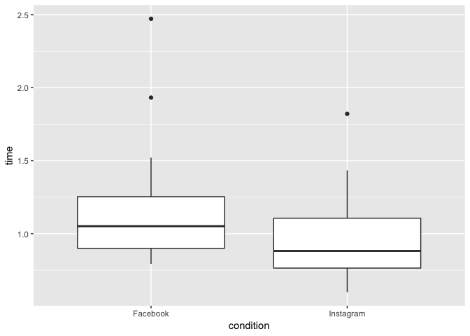
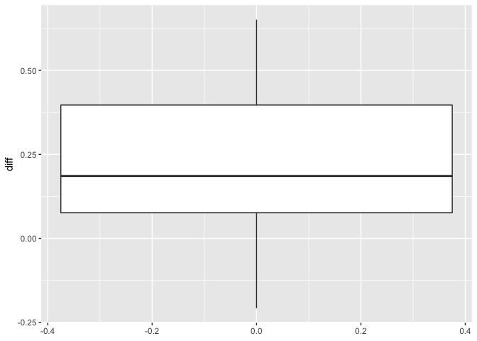

DriversExample
================
Kevin Cummiskey
9/18/2019

``` r
drivers = read.table(file = "driverData",
                     header = TRUE)

# the gather command below converts from wide to long format
drivers %>% 
  gather(key = "condition", value = "time", -participant) %>%
  ggplot(aes(x = condition, y = time)) + geom_boxplot()
```

<!-- -->

``` r
drivers = drivers %>% mutate(diff = Facebook - Instagram)

drivers %>% ggplot(aes(y = diff)) + geom_boxplot()
```

<!-- -->

``` r
#Two sample t test - DON"T DO THIS
t.test(drivers$Facebook, drivers$Instagram)
```

    ## 
    ##  Welch Two Sample t-test
    ## 
    ## data:  drivers$Facebook and drivers$Instagram
    ## t = 1.6832, df = 30.827, p-value = 0.1024
    ## alternative hypothesis: true difference in means is not equal to 0
    ## 95 percent confidence interval:
    ##  -0.04427421  0.46201977
    ## sample estimates:
    ## mean of x mean of y 
    ## 1.1787644 0.9698917

``` r
#Paired t test
t.test(drivers$Facebook, drivers$Instagram,
       paired = TRUE)
```

    ## 
    ##  Paired t-test
    ## 
    ## data:  drivers$Facebook and drivers$Instagram
    ## t = 3.7261, df = 17, p-value = 0.00168
    ## alternative hypothesis: true difference in means is not equal to 0
    ## 95 percent confidence interval:
    ##  0.0906049 0.3271407
    ## sample estimates:
    ## mean of the differences 
    ##               0.2088728

``` r
#This is equivalent to a one-sample test on the 
# different in means.
t.test(drivers$diff)
```

    ## 
    ##  One Sample t-test
    ## 
    ## data:  drivers$diff
    ## t = 3.7261, df = 17, p-value = 0.00168
    ## alternative hypothesis: true mean is not equal to 0
    ## 95 percent confidence interval:
    ##  0.0906049 0.3271407
    ## sample estimates:
    ## mean of x 
    ## 0.2088728

Here is the statistical model

\[y_{ij} = \mu + \alpha_i + \beta_j + \epsilon_{ij}\]

where \(i\) is subject \(i\) and \(j = 1\) is Facebook and \(j=2\) is
Instagram.

``` r
#Reshape data.frame to long format
drivers_long = drivers %>% select(participant, Facebook, Instagram)%>% gather(key = "condition", value = "time", -participant)

drivers_long
```

    ##    participant condition    time
    ## 1            1  Facebook 2.47200
    ## 2            2  Facebook 1.25400
    ## 3            3  Facebook 1.10000
    ## 4            4  Facebook 1.02100
    ## 5            5  Facebook 0.86400
    ## 6            6  Facebook 0.79335
    ## 7            7  Facebook 1.25211
    ## 8            8  Facebook 0.85557
    ## 9            9  Facebook 0.81400
    ## 10          10  Facebook 1.93225
    ## 11          11  Facebook 1.52087
    ## 12          12  Facebook 0.95634
    ## 13          13  Facebook 1.03615
    ## 14          14  Facebook 1.31193
    ## 15          15  Facebook 0.88127
    ## 16          16  Facebook 1.07502
    ## 17          17  Facebook 1.01121
    ## 18          18  Facebook 1.06669
    ## 19           1 Instagram 1.82100
    ## 20           2 Instagram 0.96300
    ## 21           3 Instagram 0.60000
    ## 22           4 Instagram 0.94700
    ## 23           5 Instagram 0.72600
    ## 24           6 Instagram 0.81668
    ## 25           7 Instagram 1.13434
    ## 26           8 Instagram 0.86113
    ## 27           9 Instagram 1.02224
    ## 28          10 Instagram 1.43333
    ## 29          11 Instagram 1.26431
    ## 30          12 Instagram 0.87378
    ## 31          13 Instagram 0.71460
    ## 32          14 Instagram 0.89001
    ## 33          15 Instagram 0.74724
    ## 34          16 Instagram 0.62668
    ## 35          17 Instagram 1.18336
    ## 36          18 Instagram 0.83335

``` r
#calculate SSE,SSR,SST by hand
#Overall Mean
drivers_long = drivers_long %>% mutate(mean1 = mean(time))
#Media Effect
drivers_long = drivers_long %>% group_by(condition) %>%
  mutate(meanCondition = mean(time))
drivers_long = drivers_long %>% group_by(condition) %>%
  mutate(mediaEffect = meanCondition - mean1)
#Person Effect
drivers_long = drivers_long %>% group_by(participant) %>% 
  mutate(meanPerson = mean(time))
drivers_long = drivers_long %>% group_by(participant) %>% 
  mutate(personEffect = mean(time) - mean1)
#Prediction
drivers_long = drivers_long %>% group_by(participant) %>% 
  mutate(prediction = mean1 + mediaEffect + personEffect)
#Residual
drivers_long = drivers_long %>% group_by(participant) %>% 
  mutate(residual = time - prediction)

#Note these are the same in the text
SSE = sum(drivers_long$residual^2)
SST = sum((drivers_long$time - drivers_long$mean1)^2)
SSmedia = sum((drivers_long$meanCondition - drivers_long$mean1)^2)
SSperson = sum((drivers_long$meanPerson - drivers_long$mean1)^2)
SSE
```

    ## [1] 0.4807685

``` r
SST
```

    ## [1] 5.10477

``` r
SSmedia
```

    ## [1] 0.3926505

``` r
SSperson
```

    ## [1] 4.231351

``` r
#Instead of calculating with equation,
#use the R linear model
#The answers from anova will be the same as above
drivers_long$participant = as.factor(drivers_long$participant)
contrasts(drivers_long$participant) = contr.sum 
drivers_long$condition = as.factor(drivers_long$condition) 
contrasts(drivers_long$condition) = contr.sum 
model = lm(time ~ condition + participant, data = drivers_long)
summary(model)
```

    ## 
    ## Call:
    ## lm(formula = time ~ condition + participant, data = drivers_long)
    ## 
    ## Residuals:
    ##      Min       1Q   Median       3Q      Max 
    ## -0.22106 -0.07721  0.00000  0.07721  0.22106 
    ## 
    ## Coefficients:
    ##               Estimate Std. Error t value Pr(>|t|)    
    ## (Intercept)    1.07433    0.02803  38.331  < 2e-16 ***
    ## condition1     0.10444    0.02803   3.726  0.00168 ** 
    ## participant1   1.07217    0.11556   9.278 4.59e-08 ***
    ## participant2   0.03417    0.11556   0.296  0.77104    
    ## participant3  -0.22433    0.11556  -1.941  0.06900 .  
    ## participant4  -0.09033    0.11556  -0.782  0.44518    
    ## participant5  -0.27933    0.11556  -2.417  0.02717 *  
    ## participant6  -0.26931    0.11556  -2.330  0.03235 *  
    ## participant7   0.11890    0.11556   1.029  0.31797    
    ## participant8  -0.21598    0.11556  -1.869  0.07896 .  
    ## participant9  -0.15621    0.11556  -1.352  0.19418    
    ## participant10  0.60846    0.11556   5.265 6.32e-05 ***
    ## participant11  0.31826    0.11556   2.754  0.01355 *  
    ## participant12 -0.15927    0.11556  -1.378  0.18601    
    ## participant13 -0.19895    0.11556  -1.722  0.10329    
    ## participant14  0.02664    0.11556   0.231  0.82042    
    ## participant15 -0.26007    0.11556  -2.250  0.03795 *  
    ## participant16 -0.22348    0.11556  -1.934  0.06996 .  
    ## participant17  0.02296    0.11556   0.199  0.84489    
    ## ---
    ## Signif. codes:  0 '***' 0.001 '**' 0.01 '*' 0.05 '.' 0.1 ' ' 1
    ## 
    ## Residual standard error: 0.1682 on 17 degrees of freedom
    ## Multiple R-squared:  0.9058, Adjusted R-squared:  0.8061 
    ## F-statistic: 9.084 on 18 and 17 DF,  p-value: 1.677e-05

``` r
anova(model)
```

    ## Analysis of Variance Table
    ## 
    ## Response: time
    ##             Df Sum Sq Mean Sq F value    Pr(>F)    
    ## condition    1 0.3927 0.39265 13.8841   0.00168 ** 
    ## participant 17 4.2314 0.24890  8.8012 2.293e-05 ***
    ## Residuals   17 0.4808 0.02828                      
    ## ---
    ## Signif. codes:  0 '***' 0.001 '**' 0.01 '*' 0.05 '.' 0.1 ' ' 1
