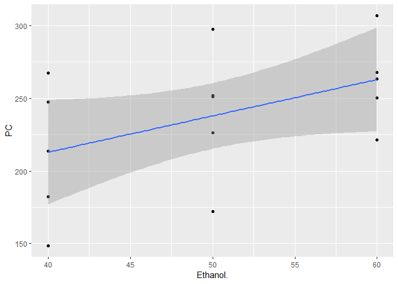
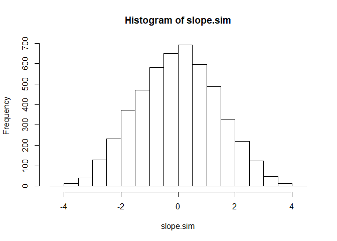

Example4.1
================
Kevin Cummiskey
October 10, 2019

Read in data and perform data analysis.

``` r
seeds = read.table(file = "http://www.isi-stats.com/isi2/data/Polyphenols.txt",
                   header = T)
seeds %>% ggplot(aes(x = Ethanol., y = PC )) + geom_point() +
  geom_smooth(method = "lm")
```



Let's fit a seperate means model (One-way ANOVA).

*y*<sub>*i**j*</sub> = *μ* + *α*<sub>*j*</sub> + *ϵ*<sub>*i**j*</sub>

for *α*<sub>1</sub> + *α*<sub>2</sub> = 0

*ϵ*<sub>*i**j*</sub> ∼  Normal(0, *σ*<sup>2</sup>)

What assumptions does this model make about PC as ethanol increases?

Note the 2 degrees of freedom in the model.

``` r
#Convert Ethanol to a factor
seeds$Ethanol_factor = factor(seeds$Ethanol.)
contrasts(seeds$Ethanol_factor) = contr.sum

modelANOVA = lm(PC ~ Ethanol_factor, data = seeds)
summary(modelANOVA)
```

    ## 
    ## Call:
    ## lm(formula = PC ~ Ethanol_factor, data = seeds)
    ## 
    ## Residuals:
    ##    Min     1Q Median     3Q    Max 
    ## -67.74 -21.60   1.84  23.85  57.66 
    ## 
    ## Coefficients:
    ##                 Estimate Std. Error t value Pr(>|t|)    
    ## (Intercept)       237.90      10.91  21.805 5.08e-11 ***
    ## Ethanol_factor1   -25.94      15.43  -1.681    0.119    
    ## Ethanol_factor2     1.84      15.43   0.119    0.907    
    ## ---
    ## Signif. codes:  0 '***' 0.001 '**' 0.01 '*' 0.05 '.' 0.1 ' ' 1
    ## 
    ## Residual standard error: 42.26 on 12 degrees of freedom
    ## Multiple R-squared:  0.2268, Adjusted R-squared:  0.09794 
    ## F-statistic:  1.76 on 2 and 12 DF,  p-value: 0.2137

``` r
anova(modelANOVA)
```

    ## Analysis of Variance Table
    ## 
    ## Response: PC
    ##                Df  Sum Sq Mean Sq F value Pr(>F)
    ## Ethanol_factor  2  6285.4  3142.7    1.76 0.2137
    ## Residuals      12 21427.1  1785.6

Next, let's fit a linear regression model.

*y*<sub>*i**j*</sub> = *β*<sub>0</sub> + *β*<sub>1</sub>*x*<sub>*i*</sub> + *ϵ*<sub>*i**j*</sub>

where *x*<sub>*i*</sub> is the ethanol level of the *i*th grape.

What assumptions does this model make about PC as ethanol increases?

How could you use linear regression to obtain same estimates as ANOVA?

Note the 1 degree of freedom in the model.

Which is better, 1 degree of freedom or 2? Why?

``` r
modelLinear = lm(PC ~ Ethanol., data = seeds)
summary(modelLinear)
```

    ## 
    ## Call:
    ## lm(formula = PC ~ Ethanol., data = seeds)
    ## 
    ## Residuals:
    ##    Min     1Q Median     3Q    Max 
    ## -65.90 -21.55   0.92  24.31  59.50 
    ## 
    ## Coefficients:
    ##             Estimate Std. Error t value Pr(>|t|)  
    ## (Intercept)  112.800     65.081   1.733   0.1067  
    ## Ethanol.       2.502      1.285   1.948   0.0734 .
    ## ---
    ## Signif. codes:  0 '***' 0.001 '**' 0.01 '*' 0.05 '.' 0.1 ' ' 1
    ## 
    ## Residual standard error: 40.62 on 13 degrees of freedom
    ## Multiple R-squared:  0.2259, Adjusted R-squared:  0.1663 
    ## F-statistic: 3.793 on 1 and 13 DF,  p-value: 0.07338

``` r
anova(modelLinear)
```

    ## Analysis of Variance Table
    ## 
    ## Response: PC
    ##           Df Sum Sq Mean Sq F value  Pr(>F)  
    ## Ethanol.   1   6260  6260.0  3.7935 0.07338 .
    ## Residuals 13  21453  1650.2                  
    ## ---
    ## Signif. codes:  0 '***' 0.001 '**' 0.01 '*' 0.05 '.' 0.1 ' ' 1

Simulation-based inference for the slope, *β*<sub>1</sub>.

``` r
#Observed statistic
slope = coef(modelLinear)[2]
slope.sim = c()
m = 5000

for(i in 1:m){
  seeds$PC.sim = sample(seeds$PC)
  modelLinear.sim = lm(PC.sim ~ Ethanol., data = seeds)
  slope.sim[i] = coef(modelLinear.sim)[2]
}

hist(slope.sim)
```



``` r
sum(abs(slope.sim)> slope)/m
```

    ## [1] 0.0732
