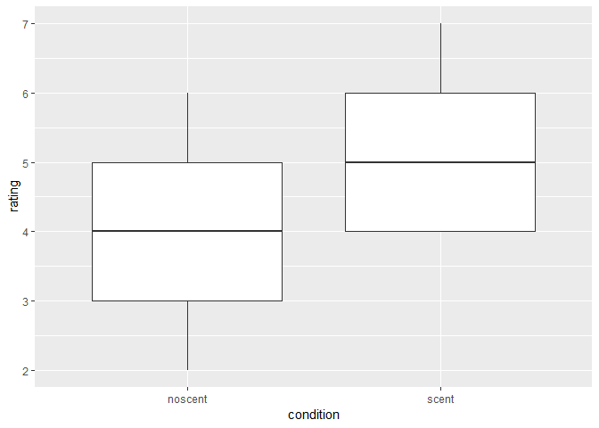

Example 1\_2
================
Kevin Cummiskey
August 29, 2019

Let's look at the data:

``` r
odor %>% ggplot(aes(x = condition, y = rating)) +
  geom_boxplot()
```



Single Mean Model

*y*<sub>*i*, *j*</sub> = *μ* + *ϵ*<sub>*i*, *j*</sub>

``` r
odor = odor %>% mutate(mean1 = mean(rating))
```

    ## Warning: The `printer` argument is deprecated as of rlang 0.3.0.
    ## This warning is displayed once per session.

``` r
odor = odor %>% mutate(residuals1 = rating - mean1)

#The standard error of this model is the 
#standard deviation of the residuals

#standard error 
SE = odor %>% summarise(sum(residuals1^2)/47)

#Sum of Squares Total (SST)
SST = odor %>% summarise(sum(residuals1^2))

#Shortcut
model1 = lm(rating ~ 1, data = odor)
summary(model1)
```

    ## 
    ## Call:
    ## lm(formula = rating ~ 1, data = odor)
    ## 
    ## Residuals:
    ##     Min      1Q  Median      3Q     Max 
    ## -2.4792 -0.4792  0.5208  0.5208  2.5208 
    ## 
    ## Coefficients:
    ##             Estimate Std. Error t value Pr(>|t|)    
    ## (Intercept)   4.4792     0.1835   24.41   <2e-16 ***
    ## ---
    ## Signif. codes:  0 '***' 0.001 '**' 0.01 '*' 0.05 '.' 0.1 ' ' 1
    ## 
    ## Residual standard error: 1.271 on 47 degrees of freedom

Separate Means Model

*y*<sub>*i*, *j*</sub> = *μ*<sub>*j*</sub> + *ϵ*<sub>*i*, *j*</sub>

``` r
#calculate means for each group
odor = odor %>% group_by(condition) %>% 
  mutate(mean2 = mean(rating))
odor = odor %>% group_by()

#residuals
odor = odor %>% mutate(residuals2 = rating - mean2)

#standard error
SE2 = odor %>% summarise(sqrt(sum((rating - mean2)^2)/46))

#Sums of Squared Error (SSE)
SSE2 = odor %>% summarise(sum((rating - mean2)^2))

SSModel = SST - SSE2

#Shortcut
model2 = lm(rating ~ condition, data = odor)
summary(model2)
```

    ## 
    ## Call:
    ## lm(formula = rating ~ condition, data = odor)
    ## 
    ## Residuals:
    ##     Min      1Q  Median      3Q     Max 
    ## -1.8333 -0.8333 -0.1250  0.8750  2.1667 
    ## 
    ## Coefficients:
    ##                Estimate Std. Error t value Pr(>|t|)    
    ## (Intercept)      3.8333     0.2251  17.027  < 2e-16 ***
    ## conditionscent   1.2917     0.3184   4.057 0.000191 ***
    ## ---
    ## Signif. codes:  0 '***' 0.001 '**' 0.01 '*' 0.05 '.' 0.1 ' ' 1
    ## 
    ## Residual standard error: 1.103 on 46 degrees of freedom
    ## Multiple R-squared:  0.2635, Adjusted R-squared:  0.2475 
    ## F-statistic: 16.46 on 1 and 46 DF,  p-value: 0.0001907

``` r
anova(model2)
```

    ## Analysis of Variance Table
    ## 
    ## Response: rating
    ##           Df Sum Sq Mean Sq F value    Pr(>F)    
    ## condition  1 20.021 20.0208  16.458 0.0001907 ***
    ## Residuals 46 55.958  1.2165                      
    ## ---
    ## Signif. codes:  0 '***' 0.001 '**' 0.01 '*' 0.05 '.' 0.1 ' ' 1
