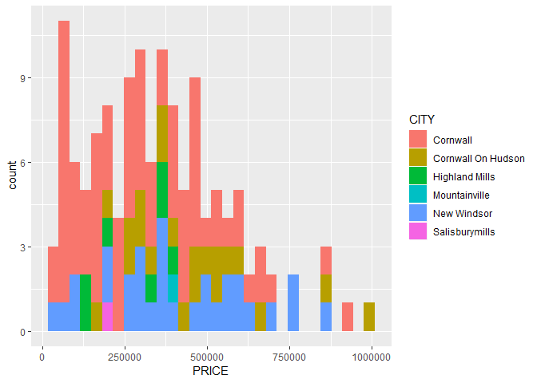
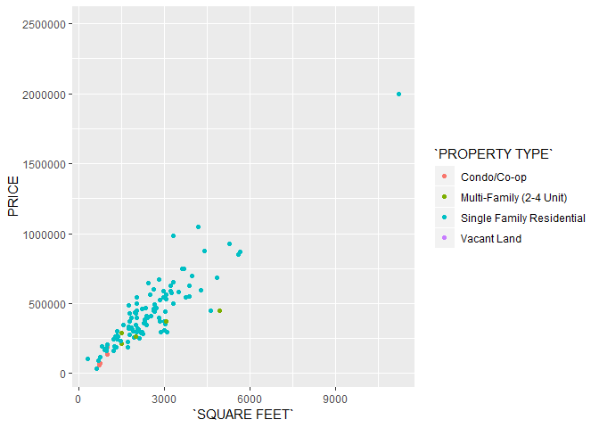
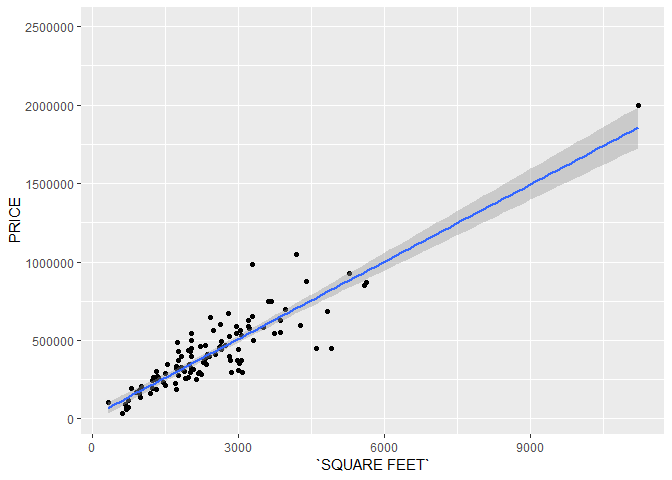
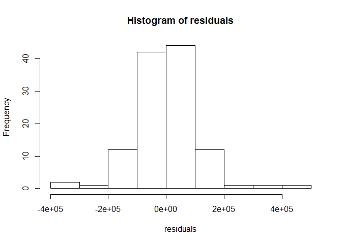

Exploration Example
================
Kevin Cummiskey
August 22, 2019

Let *x* = *y* + 5

Step 1. Ask a Research Question
-------------------------------

What are major factors affecting houses prices in Cornwall?

Step 2. Design a Study and Collect Data
---------------------------------------

Let's do some data analysis

``` r
houses %>% group_by(CITY) %>% summarise(mean(PRICE), 
                     median(PRICE),
                     sd(PRICE), n())
```

    ## Warning: The `printer` argument is deprecated as of rlang 0.3.0.
    ## This warning is displayed once per session.

    ## # A tibble: 6 x 5
    ##   CITY               `mean(PRICE)` `median(PRICE)` `sd(PRICE)` `n()`
    ##   <chr>                      <dbl>           <dbl>       <dbl> <int>
    ## 1 Cornwall                 306868.          274900     204967.    73
    ## 2 Cornwall On Hudson       544259.          449900     392597.    23
    ## 3 Highland Mills           549112.          334450     795200.     8
    ## 4 Mountainville            385000           385000        NaN      1
    ## 5 New Windsor              409447.          374750     216097.    30
    ## 6 Salisburymills           199900           199900        NaN      1

Here are some descriptive plots

``` r
houses %>% filter(PRICE < 1000000) %>% ggplot(aes(x = PRICE, fill = CITY)) + geom_histogram()
```

    ## `stat_bin()` using `bins = 30`. Pick better value with `binwidth`.



``` r
houses %>% ggplot(aes(x = `SQUARE FEET`, 
                      y = PRICE,
                      color = `PROPERTY TYPE`)) + geom_point()
```

    ## Warning: Removed 20 rows containing missing values (geom_point).



Here, we will fit a linear model to the data.

``` r
houses %>% ggplot(aes(x = `SQUARE FEET`, y = PRICE)) +
  geom_point() + geom_smooth(method = "lm")
```

    ## Warning: Removed 20 rows containing non-finite values (stat_smooth).

    ## Warning: Removed 20 rows containing missing values (geom_point).



``` r
linear_model = lm(PRICE ~ `SQUARE FEET`, data = houses)
summary(linear_model)
```

    ## 
    ## Call:
    ## lm(formula = PRICE ~ `SQUARE FEET`, data = houses)
    ## 
    ## Residuals:
    ##     Min      1Q  Median      3Q     Max 
    ## -374151  -64808    3373   47596  427900 
    ## 
    ## Coefficients:
    ##                Estimate Std. Error t value Pr(>|t|)    
    ## (Intercept)   16640.269  20520.850   0.811    0.419    
    ## `SQUARE FEET`   163.975      7.385  22.204   <2e-16 ***
    ## ---
    ## Signif. codes:  0 '***' 0.001 '**' 0.01 '*' 0.05 '.' 0.1 ' ' 1
    ## 
    ## Residual standard error: 110200 on 114 degrees of freedom
    ##   (20 observations deleted due to missingness)
    ## Multiple R-squared:  0.8122, Adjusted R-squared:  0.8105 
    ## F-statistic:   493 on 1 and 114 DF,  p-value: < 2.2e-16

``` r
residuals = residuals(linear_model)
hist(residuals)
```


