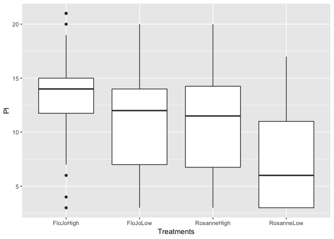
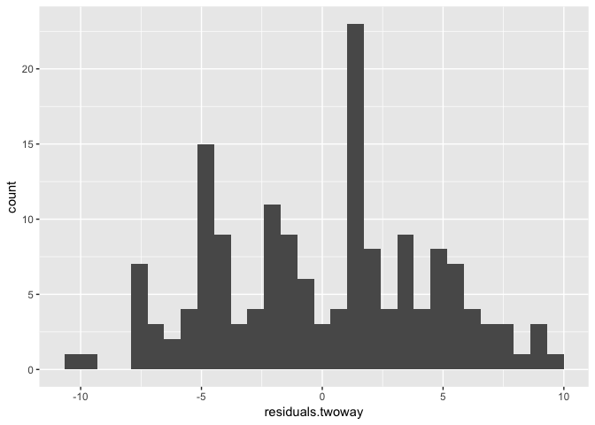
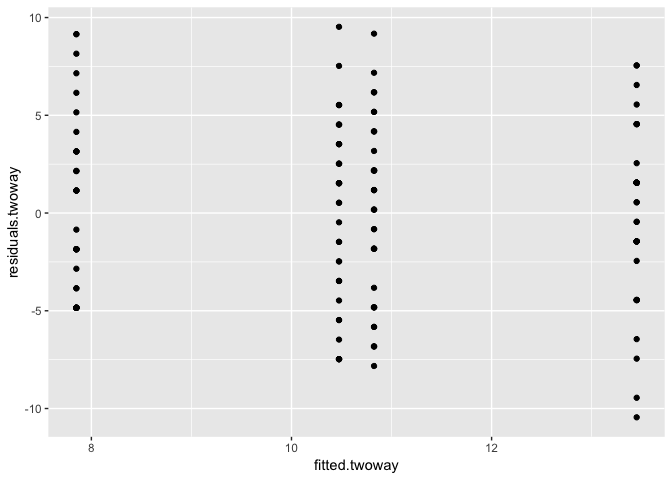

FloJo
================
Kevin Cummiskey
9/29/2019

Read in the data and perform basic data
analysis

``` r
cred = read.table(file = "http://www.isi-stats.com/isi2/data/CorporateCredibility.txt",
                  header = TRUE)

cred %>% group_by(Treatments) %>% summarise(mean(PI), sd(PI), n())
```

    ## # A tibble: 4 x 4
    ##   Treatments  `mean(PI)` `sd(PI)` `n()`
    ##   <fct>            <dbl>    <dbl> <int>
    ## 1 FloJoHigh        13.3      4.29    40
    ## 2 FloJoLow         10.6      4.71    40
    ## 3 RosanneHigh      11.0      4.49    40
    ## 4 RosanneLow        7.72     4.37    40

``` r
cred %>% ggplot(aes(x = Treatments, y = PI)) + geom_boxplot()
```

<!-- -->

One-variable analysis (p202) of purchase intent by treatment (this is
not the best idea).

1.  You cannot answer the question in terms of the explanatory variables

2.  You unnecessarily lose degrees of freedom.

<!-- end list -->

``` r
cred$Endorser = factor(cred$Endorser)
cred$CorpCred = factor(cred$CorpCred)
contrasts(cred$Endorser) = contr.sum
contrasts(cred$CorpCred) = contr.sum

oneway.lm = lm(PI ~ Treatments, data = cred)
summary(oneway.lm)
```

    ## 
    ## Call:
    ## lm(formula = PI ~ Treatments, data = cred)
    ## 
    ## Residuals:
    ##      Min       1Q   Median       3Q      Max 
    ## -10.3250  -3.7813   0.5375   3.2750   9.4000 
    ## 
    ## Coefficients:
    ##                       Estimate Std. Error t value Pr(>|t|)    
    ## (Intercept)            13.3250     0.7065  18.862  < 2e-16 ***
    ## TreatmentsFloJoLow     -2.7250     0.9991  -2.728  0.00711 ** 
    ## TreatmentsRosanneHigh  -2.3750     0.9991  -2.377  0.01866 *  
    ## TreatmentsRosanneLow   -5.6000     0.9991  -5.605 9.21e-08 ***
    ## ---
    ## Signif. codes:  0 '***' 0.001 '**' 0.01 '*' 0.05 '.' 0.1 ' ' 1
    ## 
    ## Residual standard error: 4.468 on 156 degrees of freedom
    ## Multiple R-squared:  0.1687, Adjusted R-squared:  0.1527 
    ## F-statistic: 10.56 on 3 and 156 DF,  p-value: 2.327e-06

``` r
anova(oneway.lm)
```

    ## Analysis of Variance Table
    ## 
    ## Response: PI
    ##             Df  Sum Sq Mean Sq F value    Pr(>F)    
    ## Treatments   3  632.15 210.717  10.555 2.327e-06 ***
    ## Residuals  156 3114.25  19.963                      
    ## ---
    ## Signif. codes:  0 '***' 0.001 '**' 0.01 '*' 0.05 '.' 0.1 ' ' 1

Fit a two-way ANOVA. Note the SS for CorpCred and SS for Endorser are
the same as they would have been if we fit a one-way ANOVA for each of
these variables. This occurs because of the balanced design.

``` r
twoway.lm = lm(PI ~ CorpCred + Endorser, data = cred)
summary(twoway.lm)
```

    ## 
    ## Call:
    ## lm(formula = PI ~ CorpCred + Endorser, data = cred)
    ## 
    ## Residuals:
    ##      Min       1Q   Median       3Q      Max 
    ## -10.4500  -3.8500   0.5375   3.1500   9.5250 
    ## 
    ## Coefficients:
    ##             Estimate Std. Error t value Pr(>|t|)    
    ## (Intercept)  10.6500     0.3522  30.235  < 2e-16 ***
    ## CorpCred1     1.4875     0.3522   4.223 4.07e-05 ***
    ## Endorser1     1.3125     0.3522   3.726 0.000271 ***
    ## ---
    ## Signif. codes:  0 '***' 0.001 '**' 0.01 '*' 0.05 '.' 0.1 ' ' 1
    ## 
    ## Residual standard error: 4.456 on 157 degrees of freedom
    ## Multiple R-squared:  0.1681, Adjusted R-squared:  0.1575 
    ## F-statistic: 15.86 on 2 and 157 DF,  p-value: 5.332e-07

``` r
anova(twoway.lm)
```

    ## Analysis of Variance Table
    ## 
    ## Response: PI
    ##            Df  Sum Sq Mean Sq F value    Pr(>F)    
    ## CorpCred    1  354.02  354.02  17.833 4.071e-05 ***
    ## Endorser    1  275.63  275.63  13.884 0.0002708 ***
    ## Residuals 157 3116.75   19.85                      
    ## ---
    ## Signif. codes:  0 '***' 0.001 '**' 0.01 '*' 0.05 '.' 0.1 ' ' 1

Let’s look at the residuals

``` r
cred$residuals.twoway = residuals(twoway.lm)
cred$fitted.twoway = fitted.values(twoway.lm)

cred %>% ggplot(aes(x = residuals.twoway)) + geom_histogram()
```

    ## `stat_bin()` using `bins = 30`. Pick better value with `binwidth`.

<!-- -->

``` r
cred %>% ggplot(aes(x = fitted.twoway, y = residuals.twoway)) + geom_point()
```

<!-- -->
