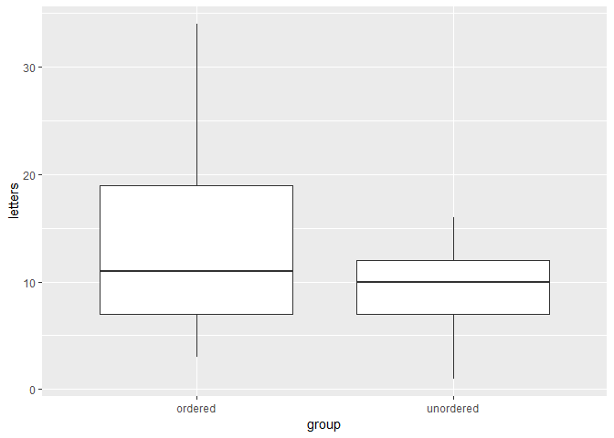
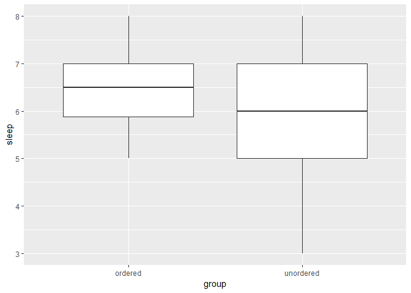

Exploration 11
================
Kevin Cummiskey
August 28, 2019

Perform some data analysis.
===========================

``` r
table = memory %>% group_by(group) %>% summarise(mean(letters),
                                         sd(letters),
                                         mean(sleep),
                                         sd(sleep),
                                         mean(caffeine),
                                         n())
```

    ## Warning: The `printer` argument is deprecated as of rlang 0.3.0.
    ## This warning is displayed once per session.

``` r
kable(table)
```

| group     |  mean(letters)|  sd(letters)|  mean(sleep)|  sd(sleep)|  mean(caffeine)|  n()|
|:----------|--------------:|------------:|------------:|----------:|---------------:|----:|
| ordered   |          13.35|     7.576105|         6.35|  0.8599266|            0.35|   20|
| unordered |           9.80|     4.443801|         5.75|  1.4464112|            0.55|   20|

``` r
memory %>% ggplot(aes(x = group, y = letters)) + geom_boxplot()
```



Assess confounding by sleep
===========================

``` r
memory %>% ggplot(aes(x = group, y = sleep)) + geom_boxplot()
```



Single Mean Model
=================

``` r
memory = memory %>% mutate(mean1 = mean(letters))
memory = memory %>% mutate(residuals1 = letters - mean1)

#Standard error of residuals
memory %>% summarise(sd(residuals1))
```

    ## # A tibble: 1 x 1
    ##   `sd(residuals1)`
    ##              <dbl>
    ## 1             6.39

``` r
#Note this is also the same as:
summary(lm(letters ~ 1, data = memory))
```

    ## 
    ## Call:
    ## lm(formula = letters ~ 1, data = memory)
    ## 
    ## Residuals:
    ##     Min      1Q  Median      3Q     Max 
    ## -10.575  -4.575  -1.575   4.425  22.425 
    ## 
    ## Coefficients:
    ##             Estimate Std. Error t value Pr(>|t|)    
    ## (Intercept)    11.57       1.01   11.46 4.72e-14 ***
    ## ---
    ## Signif. codes:  0 '***' 0.001 '**' 0.01 '*' 0.05 '.' 0.1 ' ' 1
    ## 
    ## Residual standard error: 6.389 on 39 degrees of freedom

Two Mean Model
==============

``` r
memory = memory %>% group_by(group) %>% mutate(mean2 = mean(letters))
memory = memory %>% mutate(residuals2 = letters - mean2)

#Standard error of residuals
memory %>% group_by() %>% summarise(sd(residuals2))
```

    ## # A tibble: 1 x 1
    ##   `sd(residuals2)`
    ##              <dbl>
    ## 1             6.13

``` r
#Note this is also the same as:
summary(lm(letters ~ group, data = memory))
```

    ## 
    ## Call:
    ## lm(formula = letters ~ group, data = memory)
    ## 
    ## Residuals:
    ##     Min      1Q  Median      3Q     Max 
    ## -10.350  -3.350  -0.575   5.650  20.650 
    ## 
    ## Coefficients:
    ##                Estimate Std. Error t value Pr(>|t|)    
    ## (Intercept)      13.350      1.389   9.613 1.01e-11 ***
    ## groupunordered   -3.550      1.964  -1.808   0.0786 .  
    ## ---
    ## Signif. codes:  0 '***' 0.001 '**' 0.01 '*' 0.05 '.' 0.1 ' ' 1
    ## 
    ## Residual standard error: 6.211 on 38 degrees of freedom
    ## Multiple R-squared:  0.07917,    Adjusted R-squared:  0.05494 
    ## F-statistic: 3.267 on 1 and 38 DF,  p-value: 0.0786
