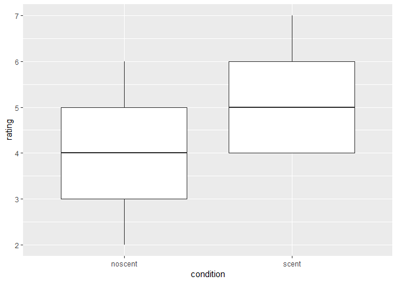

Example 1\_2practice
================
Kevin Cummiskey
September 4, 2019

Let's look at the data:

``` r
odor %>% ggplot(aes(x = condition, y = rating)) +
  geom_boxplot()
```



Let's conduct some inference

In words, we would want to test these hypotheses:

*H*<sub>0</sub>: There is no association between being exposed to the scent and the rating of the store.

*H*<sub>*a*</sub>: There is no association between being exposed to the scent and the rating of the store.
