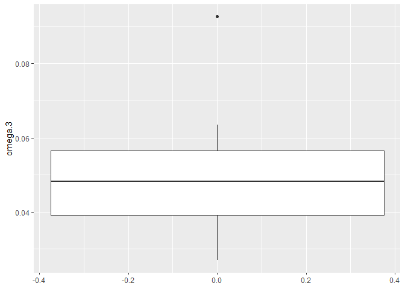
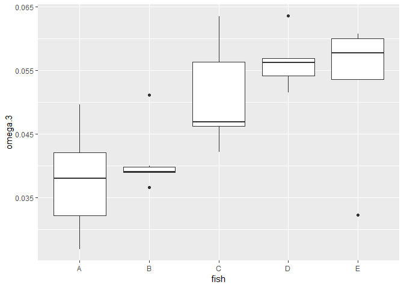
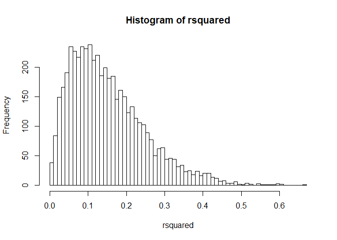
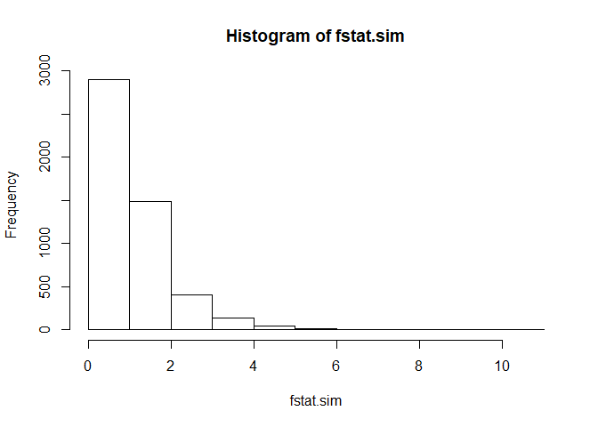
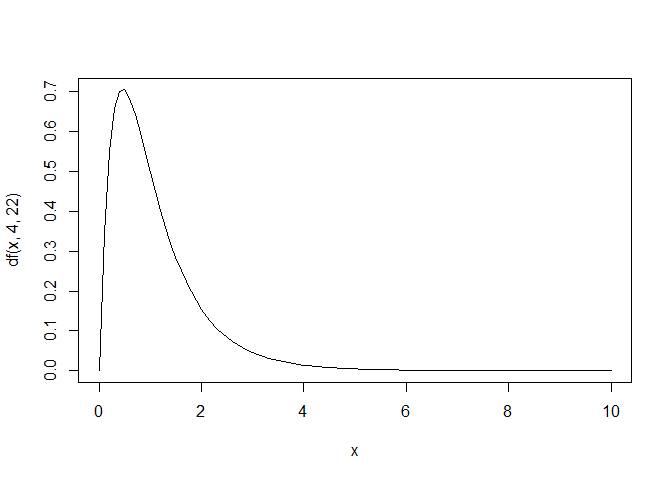

Omega3
================
Kevin Cummiskey
September 10, 2019

Let's perform some data analysis.

``` r
#descriptive statistics
diet %>% group_by(fish) %>% summarise(mean(omega.3),
                                      sd(omega.3),
                                      n())
```

    ## Warning: The `printer` argument is deprecated as of rlang 0.3.0.
    ## This warning is displayed once per session.

    ## # A tibble: 5 x 4
    ##   fish  `mean(omega.3)` `sd(omega.3)` `n()`
    ##   <fct>           <dbl>         <dbl> <int>
    ## 1 A              0.0377       0.00826     6
    ## 2 B              0.0408       0.00520     6
    ## 3 C              0.0510       0.00871     5
    ## 4 D              0.0565       0.00447     5
    ## 5 E              0.0595       0.0194      6

``` r
diet %>% ggplot(aes(y = omega.3)) + geom_boxplot()
```



``` r
diet = diet %>% filter(omega.3 < 0.08)

diet %>% ggplot(aes(x = fish, y = omega.3)) + geom_boxplot()
```



Fit a single mean model

*y*<sub>*i**j*</sub> = *μ* + *ϵ*<sub>*i**j*</sub>

``` r
diet = diet %>% mutate(mean1 = mean(omega.3))
SST = sum((diet$omega.3-diet$mean1)^2)
```

Fit a separate means model

*y*<sub>*i**j*</sub> = *μ*<sub>*j*</sub> + *ϵ*<sub>*i**j*</sub>

``` r
diet = diet %>% group_by(fish) %>% mutate(mean2 = mean(omega.3))

#SSE
SSE = sum((diet$omega.3 - diet$mean2)^2)

#SSR
SSR = SST - SSE

#R^2
R2 = SSR/SST

#Fstat
Fstat = (SSR/4)/(SSE/22)
#Question: when is the Fstat big?


model = lm(omega.3 ~ fish, data = diet)
anova(model)
```

    ## Analysis of Variance Table
    ## 
    ## Response: omega.3
    ##           Df    Sum Sq    Mean Sq F value   Pr(>F)   
    ## fish       4 0.0014545 0.00036363  5.6266 0.002825 **
    ## Residuals 22 0.0014218 0.00006463                    
    ## ---
    ## Signif. codes:  0 '***' 0.001 '**' 0.01 '*' 0.05 '.' 0.1 ' ' 1

``` r
summary(model)
```

    ## 
    ## Call:
    ## lm(formula = omega.3 ~ fish, data = diet)
    ## 
    ## Residuals:
    ##        Min         1Q     Median         3Q        Max 
    ## -0.0205940 -0.0042013 -0.0008127  0.0050630  0.0125220 
    ## 
    ## Coefficients:
    ##             Estimate Std. Error t value Pr(>|t|)    
    ## (Intercept) 0.037655   0.003282  11.474 9.36e-11 ***
    ## fishB       0.003111   0.004641   0.670 0.509611    
    ## fishC       0.013336   0.004868   2.740 0.011966 *  
    ## fishD       0.018812   0.004868   3.864 0.000839 ***
    ## fishE       0.015176   0.004868   3.118 0.005015 ** 
    ## ---
    ## Signif. codes:  0 '***' 0.001 '**' 0.01 '*' 0.05 '.' 0.1 ' ' 1
    ## 
    ## Residual standard error: 0.008039 on 22 degrees of freedom
    ## Multiple R-squared:  0.5057, Adjusted R-squared:  0.4158 
    ## F-statistic: 5.627 on 4 and 22 DF,  p-value: 0.002825

Inference on *R*<sup>2</sup>. Simulation-based approach.

*H*<sub>0</sub> : *μ*<sub>*A*</sub> = ⋯ = *μ*<sub>*E*</sub> *H*<sub>*a*</sub> : at least one of the means not equal to the others

``` r
m = 5000
rsquared = c() #vector for simulated R2
fstat.sim = c() #vector for simulated Fstat

#Simulation
for(i in 1:m){
  diet$sim.fish = sample(diet$fish) #shuffle fish categories
  diet = diet %>% group_by(sim.fish) %>% mutate(mean2.sim = mean(omega.3)) #calculate new means
  SSE.sim = sum((diet$omega.3 - diet$mean2.sim)^2) #calculate new SSE
  rsquared[i] = 1-SSE.sim/SST #calculate new R2; Question: why don't we calculate SST everytime
  fstat.sim[i] = ((SST-SSE.sim)/4)/(SSE.sim/22) #calculate Fstat
}

#Calculate p-value for R2 = 0.51
hist(rsquared, breaks = 50)
```



``` r
sum(rsquared > R2)/m
```

    ## [1] 0.0038

``` r
#Calculate p-value for Fstat = 5.62
hist(fstat.sim)
```



``` r
x = seq(0,10,0.1)
plot(x, df(x,4,22), type = "l")
```



``` r
1 - pf(5.62, 4, 22)
```

    ## [1] 0.002842483

``` r
summary(model)
```

    ## 
    ## Call:
    ## lm(formula = omega.3 ~ fish, data = diet)
    ## 
    ## Residuals:
    ##        Min         1Q     Median         3Q        Max 
    ## -0.0205940 -0.0042013 -0.0008127  0.0050630  0.0125220 
    ## 
    ## Coefficients:
    ##             Estimate Std. Error t value Pr(>|t|)    
    ## (Intercept) 0.037655   0.003282  11.474 9.36e-11 ***
    ## fishB       0.003111   0.004641   0.670 0.509611    
    ## fishC       0.013336   0.004868   2.740 0.011966 *  
    ## fishD       0.018812   0.004868   3.864 0.000839 ***
    ## fishE       0.015176   0.004868   3.118 0.005015 ** 
    ## ---
    ## Signif. codes:  0 '***' 0.001 '**' 0.01 '*' 0.05 '.' 0.1 ' ' 1
    ## 
    ## Residual standard error: 0.008039 on 22 degrees of freedom
    ## Multiple R-squared:  0.5057, Adjusted R-squared:  0.4158 
    ## F-statistic: 5.627 on 4 and 22 DF,  p-value: 0.002825

Confidence and Prediction Intervals for the Group Means

``` r
summary = diet %>%group_by(fish) %>% 
  summarise(mean =mean(omega.3),
            sd = sd(omega.3),
            n = n(),
            residuals2 = sum((omega.3-mean2)^2)
                                                 )
summary = summary %>% mutate(pooledSD = sqrt(sum(residuals2)/(27-5)))

#calculate confidence interval
summary = summary %>% mutate(LBmean = mean - qt(0.975,26)*pooledSD/sqrt(n))
summary = summary %>% mutate(UBmean = mean + qt(0.975,26)*pooledSD/sqrt(n))

#calculate prediction interval
summary = summary %>% mutate(LBprediction = mean - qt(0.975,26)*pooledSD*sqrt(1+1/n))
summary = summary %>% mutate(UBprediction = mean + qt(0.975,26)*pooledSD*sqrt(1+1/n))

summary
```

    ## # A tibble: 5 x 10
    ##   fish    mean      sd     n residuals2 pooledSD LBmean UBmean LBprediction
    ##   <fct>  <dbl>   <dbl> <int>      <dbl>    <dbl>  <dbl>  <dbl>        <dbl>
    ## 1 A     0.0377 0.00826     6  0.000341   0.00804 0.0309 0.0444       0.0198
    ## 2 B     0.0408 0.00520     6  0.000135   0.00804 0.0340 0.0475       0.0229
    ## 3 C     0.0510 0.00871     5  0.000304   0.00804 0.0436 0.0584       0.0329
    ## 4 D     0.0565 0.00447     5  0.0000800  0.00804 0.0491 0.0639       0.0384
    ## 5 E     0.0528 0.0118      5  0.000562   0.00804 0.0454 0.0602       0.0347
    ## # ... with 1 more variable: UBprediction <dbl>
