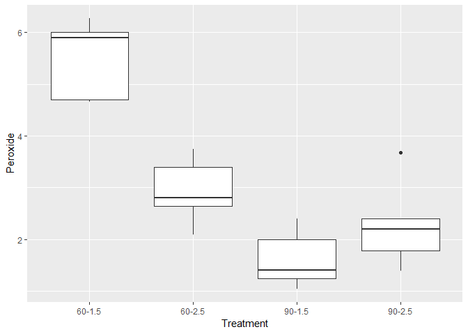
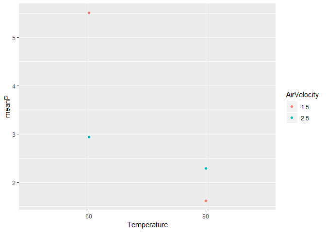
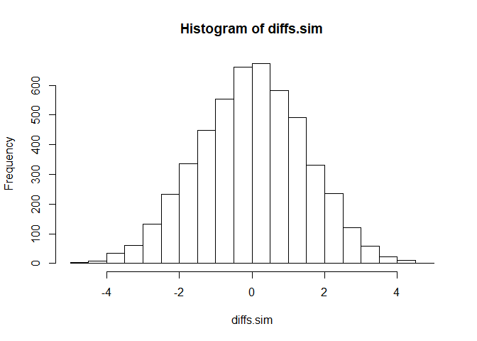

Example3.2
================
Kevin Cummiskey
10/3/2019

Load data and perform data analysis.

``` r
nuts = read.table(file = "http://www.isi-stats.com/isi2/data/pistachioStudySubset.txt",
                  header = TRUE)
nuts$Temperature = factor(nuts$Temperature)
nuts$AirVelocity = factor(nuts$AirVelocity)
contrasts(nuts$Temperature) = contr.sum
contrasts(nuts$AirVelocity) = contr.sum

nuts = nuts %>% mutate(Treatment = paste(Temperature,"-",AirVelocity, 
                                  sep = ""))
```

    ## Warning: The `printer` argument is deprecated as of rlang 0.3.0.
    ## This warning is displayed once per session.

``` r
summary = nuts %>% group_by(Temperature,AirVelocity) %>% 
  summarise(meanP = mean(Peroxide), sd(Peroxide), n())
summary
```

    ## # A tibble: 4 x 5
    ## # Groups:   Temperature [?]
    ##   Temperature AirVelocity meanP `sd(Peroxide)` `n()`
    ##   <fct>       <fct>       <dbl>          <dbl> <int>
    ## 1 60          1.5          5.51          0.766     5
    ## 2 60          2.5          2.94          0.652     5
    ## 3 90          1.5          1.62          0.561     5
    ## 4 90          2.5          2.29          0.869     5

``` r
nuts %>% ggplot(aes(x = Treatment, y = Peroxide)) +
  geom_boxplot()
```



Let's fit the main effects model (p217).

This is for a multifactor design without interactions.

``` r
mainEffects = lm(Peroxide ~ Temperature + AirVelocity, data = nuts)
summary(mainEffects)
```

    ## 
    ## Call:
    ## lm(formula = Peroxide ~ Temperature + AirVelocity, data = nuts)
    ## 
    ## Residuals:
    ##     Min      1Q  Median      3Q     Max 
    ## -1.6555 -0.9645 -0.0340  0.7695  2.1995 
    ## 
    ## Coefficients:
    ##              Estimate Std. Error t value Pr(>|t|)    
    ## (Intercept)    3.0885     0.2511  12.301 6.89e-10 ***
    ## Temperature1   1.1325     0.2511   4.510 0.000309 ***
    ## AirVelocity1   0.4755     0.2511   1.894 0.075401 .  
    ## ---
    ## Signif. codes:  0 '***' 0.001 '**' 0.01 '*' 0.05 '.' 0.1 ' ' 1
    ## 
    ## Residual standard error: 1.123 on 17 degrees of freedom
    ## Multiple R-squared:  0.5847, Adjusted R-squared:  0.5358 
    ## F-statistic: 11.97 on 2 and 17 DF,  p-value: 0.0005707

How can we tell if there is an interaction? p(218)

``` r
summary %>% ggplot(aes(x = Temperature, y = meanP, color = AirVelocity)) + 
  geom_point() 
```



Testing for an interaction p219

``` r
#Statistic - difference in differences
diffdiff = (summary$meanP[1]-summary$meanP[2]) - (summary$meanP[3]-summary$meanP[4]) 

#How extreme is this?
m = 5000
nuts.sim = nuts
diffs.sim = c()
for(i in 1:m){
  nuts.sim$Peroxide.sim = sample(nuts.sim$Peroxide)
  summary.sim = nuts.sim %>% 
    group_by(Temperature,AirVelocity) %>%
    summarise(meanP.sim = mean(Peroxide.sim))
  diffs.sim[i] = (summary.sim$meanP.sim[1]-summary.sim$meanP.sim[2]) - (summary.sim$meanP.sim[3]-summary.sim$meanP.sim[4]) 
}

hist(diffs.sim)
```



Let's fit the interaction model

``` r
fullModel = lm(Peroxide ~ Temperature*AirVelocity, data = nuts)
summary(fullModel)
```

    ## 
    ## Call:
    ## lm(formula = Peroxide ~ Temperature * AirVelocity, data = nuts)
    ## 
    ## Residuals:
    ##     Min      1Q  Median      3Q     Max 
    ## -0.9000 -0.5255 -0.1130  0.4715  1.3900 
    ## 
    ## Coefficients:
    ##                           Estimate Std. Error t value Pr(>|t|)    
    ## (Intercept)                 3.0885     0.1613  19.144 1.88e-12 ***
    ## Temperature1                1.1325     0.1613   7.020 2.89e-06 ***
    ## AirVelocity1                0.4755     0.1613   2.947 0.009463 ** 
    ## Temperature1:AirVelocity1   0.8095     0.1613   5.018 0.000126 ***
    ## ---
    ## Signif. codes:  0 '***' 0.001 '**' 0.01 '*' 0.05 '.' 0.1 ' ' 1
    ## 
    ## Residual standard error: 0.7215 on 16 degrees of freedom
    ## Multiple R-squared:  0.8386, Adjusted R-squared:  0.8083 
    ## F-statistic: 27.71 on 3 and 16 DF,  p-value: 1.422e-06

``` r
anova(fullModel)
```

    ## Analysis of Variance Table
    ## 
    ## Response: Peroxide
    ##                         Df  Sum Sq Mean Sq F value    Pr(>F)    
    ## Temperature              1 25.6511 25.6511 49.2751 2.895e-06 ***
    ## AirVelocity              1  4.5220  4.5220  8.6866 0.0094633 ** 
    ## Temperature:AirVelocity  1 13.1058 13.1058 25.1759 0.0001263 ***
    ## Residuals               16  8.3291  0.5206                      
    ## ---
    ## Signif. codes:  0 '***' 0.001 '**' 0.01 '*' 0.05 '.' 0.1 ' ' 1

``` r
nuts %>% mutate(predictionFull = predict(fullModel, nuts))
```

    ## Warning: contrasts dropped from factor Temperature

    ## Warning: contrasts dropped from factor AirVelocity

    ##    Peroxide Temperature AirVelocity Treatment predictionFull
    ## 1      5.90          60         1.5    60-1.5          5.506
    ## 2      6.27          60         1.5    60-1.5          5.506
    ## 3      4.66          60         1.5    60-1.5          5.506
    ## 4      2.09          60         2.5    60-2.5          2.936
    ## 5      3.75          60         2.5    60-2.5          2.936
    ## 6      2.64          60         2.5    60-2.5          2.936
    ## 7      1.25          90         1.5    90-1.5          1.622
    ## 8      1.05          90         1.5    90-1.5          1.622
    ## 9      1.41          90         1.5    90-1.5          1.622
    ## 10     1.78          90         2.5    90-2.5          2.290
    ## 11     3.68          90         2.5    90-2.5          2.290
    ## 12     1.39          90         2.5    90-2.5          2.290
    ## 13     6.00          60         1.5    60-1.5          5.506
    ## 14     4.70          60         1.5    60-1.5          5.506
    ## 15     2.80          60         2.5    60-2.5          2.936
    ## 16     3.40          60         2.5    60-2.5          2.936
    ## 17     2.00          90         1.5    90-1.5          1.622
    ## 18     2.40          90         1.5    90-1.5          1.622
    ## 19     2.20          90         2.5    90-2.5          2.290
    ## 20     2.40          90         2.5    90-2.5          2.290
