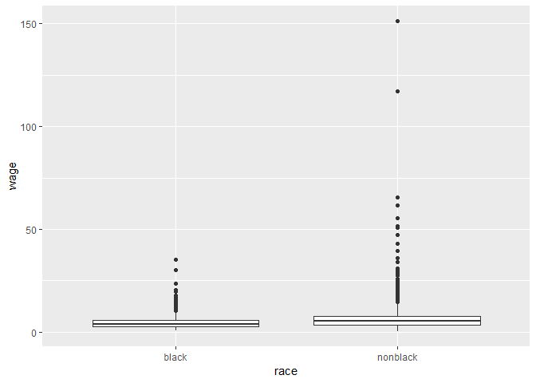
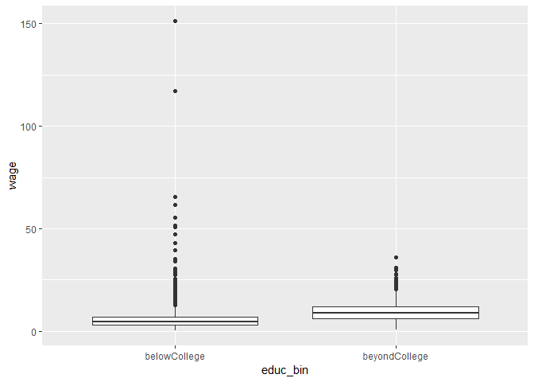

WageDiscrimination
================
Kevin Cummiskey
September 25, 2019

Load data and perform data analysis

``` r
wages_whole = read.table("http://www.isi-stats.com/isi2/data/Wages.txt",
                   header = TRUE)

#Create new variable for binary education and filter unused observations
wages = wages_whole %>% mutate(educ_bin = case_when(educ %in% c("HS","belowHS") ~ "belowCollege",
                            educ == "beyondCollege" ~ "beyondCollege")) %>%
  filter(!is.na(educ_bin))

#scale wages to match text book
wages$wage = wages$wage/100

#Wages by race
wages %>% ggplot(aes(x = race, y = wage)) + geom_boxplot()
```



Next, let's calculate the group effects (pg 174).

``` r
#summary of wages by black vs nonblack
summary.race = wages %>% group_by(race) %>% summarise(mean = mean(wage), sd = sd(wage), n = n())
summary.race
```

    ## # A tibble: 2 x 4
    ##   race      mean    sd     n
    ##   <fct>    <dbl> <dbl> <int>
    ## 1 black     4.52  3.01  1413
    ## 2 nonblack  6.21  4.29 15241

``` r
black = wages %>% filter(race == "black")
nonblack = wages %>% filter(race == "nonblack")
#group means
mean(black$wage) 
```

    ## [1] 4.520383

``` r
mean(nonblack$wage)
```

    ## [1] 6.205292

``` r
#mean of the group means
meanGroupMeans = (mean(black$wage) + mean(nonblack$wage))/2
meanGroupMeans
```

    ## [1] 5.362837

``` r
#group effects (black and nonblack)
mean(black$wage) - meanGroupMeans
```

    ## [1] -0.8424549

``` r
mean(nonblack$wage) - meanGroupMeans
```

    ## [1] 0.8424549

``` r
#Alternatively, you could get these group effects this way.
wages$race = factor(wages$race)
contrasts(wages$race) = contr.sum
race.lm = lm(wage ~ race, data = wages)
summary(race.lm)
```

    ## 
    ## Call:
    ## lm(formula = wage ~ race, data = wages)
    ## 
    ## Residuals:
    ##     Min      1Q  Median      3Q     Max 
    ##  -5.701  -2.644  -0.827   1.630 145.030 
    ## 
    ## Coefficients:
    ##             Estimate Std. Error t value Pr(>|t|)    
    ## (Intercept)   5.3628     0.0584   91.83   <2e-16 ***
    ## race1        -0.8425     0.0584  -14.43   <2e-16 ***
    ## ---
    ## Signif. codes:  0 '***' 0.001 '**' 0.01 '*' 0.05 '.' 0.1 ' ' 1
    ## 
    ## Residual standard error: 4.2 on 16652 degrees of freedom
    ## Multiple R-squared:  0.01234,    Adjusted R-squared:  0.01228 
    ## F-statistic: 208.1 on 1 and 16652 DF,  p-value: < 2.2e-16

``` r
anova(race.lm)
```

    ## Analysis of Variance Table
    ## 
    ## Response: wage
    ##              Df Sum Sq Mean Sq F value    Pr(>F)    
    ## race          1   3671  3671.1  208.11 < 2.2e-16 ***
    ## Residuals 16652 293738    17.6                      
    ## ---
    ## Signif. codes:  0 '***' 0.001 '**' 0.01 '*' 0.05 '.' 0.1 ' ' 1

Next, let's consider another variable - education (p175). Calculate group effects of education level.

``` r
#Wages by education level
wages %>% ggplot(aes(x = educ_bin, y = wage)) + geom_boxplot()
```



``` r
wages$educ_bin = factor(wages$educ_bin)
contrasts(wages$educ_bin) = contr.sum
educ.lm = lm(wage ~ educ_bin, data = wages)
summary(educ.lm)
```

    ## 
    ## Call:
    ## lm(formula = wage ~ educ_bin, data = wages)
    ## 
    ## Residuals:
    ##     Min      1Q  Median      3Q     Max 
    ##  -9.064  -2.416  -0.548   1.674 145.939 
    ## 
    ## Coefficients:
    ##             Estimate Std. Error t value Pr(>|t|)    
    ## (Intercept)  7.47713    0.03957  188.94   <2e-16 ***
    ## educ_bin1   -2.18086    0.03957  -55.11   <2e-16 ***
    ## ---
    ## Signif. codes:  0 '***' 0.001 '**' 0.01 '*' 0.05 '.' 0.1 ' ' 1
    ## 
    ## Residual standard error: 3.887 on 16652 degrees of freedom
    ## Multiple R-squared:  0.1542, Adjusted R-squared:  0.1542 
    ## F-statistic:  3037 on 1 and 16652 DF,  p-value: < 2.2e-16

``` r
anova(educ.lm)
```

    ## Analysis of Variance Table
    ## 
    ## Response: wage
    ##              Df Sum Sq Mean Sq F value    Pr(>F)    
    ## educ_bin      1  45873   45873  3036.9 < 2.2e-16 ***
    ## Residuals 16652 251535      15                      
    ## ---
    ## Signif. codes:  0 '***' 0.001 '**' 0.01 '*' 0.05 '.' 0.1 ' ' 1

Next, let's fit a two variable model (education and race). (p176)

``` r
adj.lm = lm(wage ~ race + educ_bin, data = wages)
summary(adj.lm)
```

    ## 
    ## Call:
    ## lm(formula = wage ~ race + educ_bin, data = wages)
    ## 
    ## Residuals:
    ##     Min      1Q  Median      3Q     Max 
    ##  -9.112  -2.327  -0.665   1.709 145.822 
    ## 
    ## Coefficients:
    ##             Estimate Std. Error t value Pr(>|t|)    
    ## (Intercept)  6.94269    0.06120  113.45   <2e-16 ***
    ## race1       -0.61647    0.05399  -11.42   <2e-16 ***
    ## educ_bin1   -2.14605    0.03954  -54.28   <2e-16 ***
    ## ---
    ## Signif. codes:  0 '***' 0.001 '**' 0.01 '*' 0.05 '.' 0.1 ' ' 1
    ## 
    ## Residual standard error: 3.872 on 16651 degrees of freedom
    ## Multiple R-squared:  0.1608, Adjusted R-squared:  0.1607 
    ## F-statistic:  1595 on 2 and 16651 DF,  p-value: < 2.2e-16

``` r
anova(adj.lm)
```

    ## Analysis of Variance Table
    ## 
    ## Response: wage
    ##              Df Sum Sq Mean Sq F value    Pr(>F)    
    ## race          1   3671    3671  244.92 < 2.2e-16 ***
    ## educ_bin      1  44156   44156 2945.93 < 2.2e-16 ***
    ## Residuals 16651 249581      15                      
    ## ---
    ## Signif. codes:  0 '***' 0.001 '**' 0.01 '*' 0.05 '.' 0.1 ' ' 1

``` r
#there are different ways to calculate 
#anova tables
# To match the text, install car package
library(car)
```

    ## Warning: package 'car' was built under R version 3.5.3

    ## Loading required package: carData

    ## Warning: package 'carData' was built under R version 3.5.2

    ## 
    ## Attaching package: 'car'

    ## The following object is masked from 'package:dplyr':
    ## 
    ##     recode

    ## The following object is masked from 'package:purrr':
    ## 
    ##     some

``` r
Anova(adj.lm,type=2)
```

    ## Anova Table (Type II tests)
    ## 
    ## Response: wage
    ##           Sum Sq    Df F value    Pr(>F)    
    ## race        1954     1  130.36 < 2.2e-16 ***
    ## educ_bin   44156     1 2945.93 < 2.2e-16 ***
    ## Residuals 249581 16651                      
    ## ---
    ## Signif. codes:  0 '***' 0.001 '**' 0.01 '*' 0.05 '.' 0.1 ' ' 1
